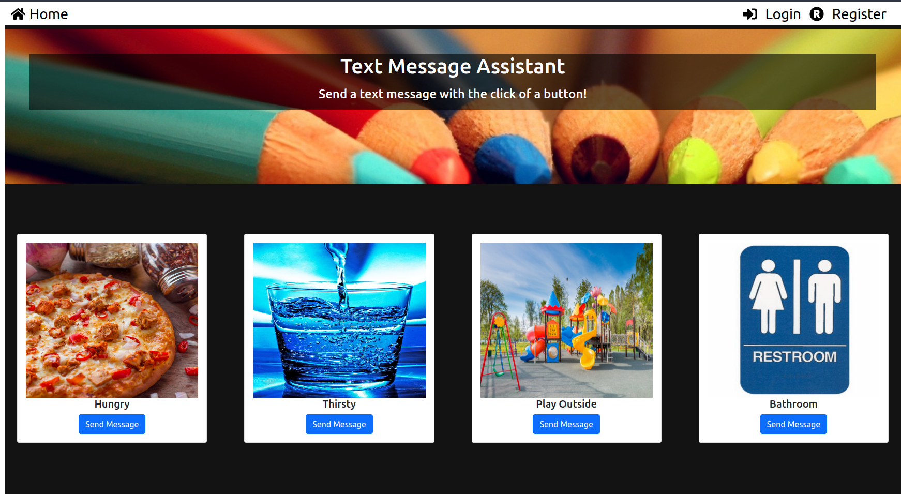
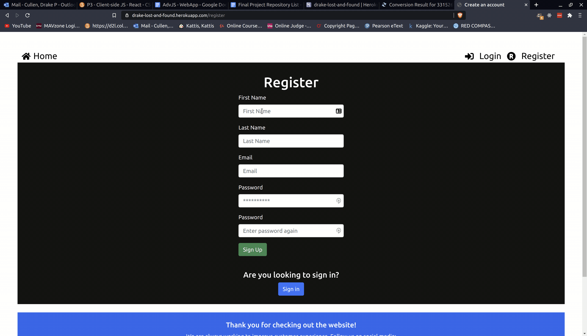
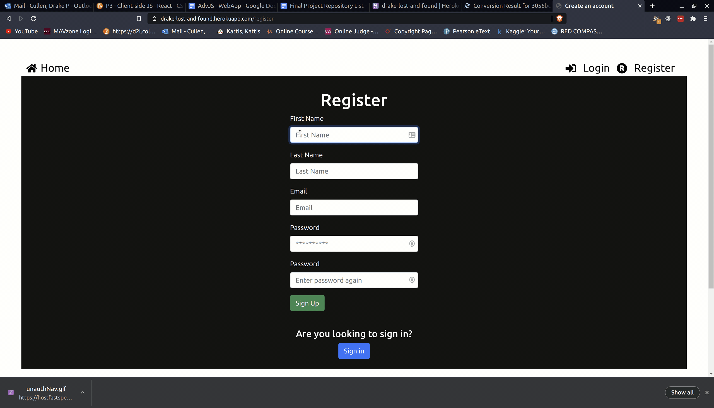
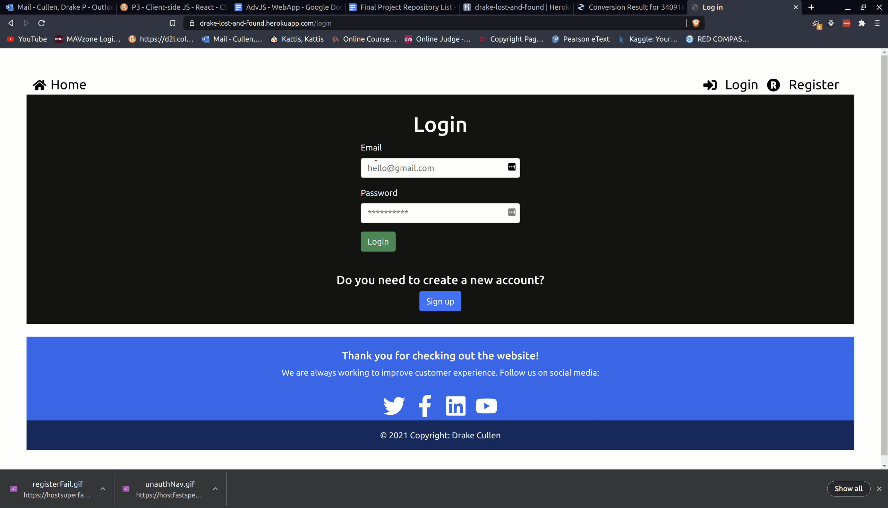
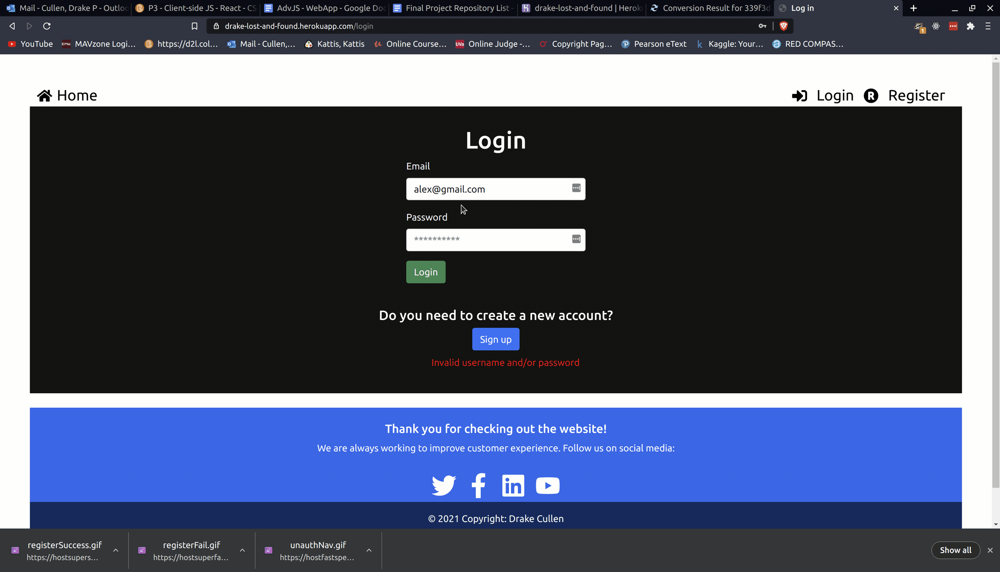

# Message assistant web application created with the MERN Stack

### I created a message assistant application for users who have difficulties typing messages. A caregiver can pre-configure messages, and a user can click the image to send a text message to their caregiver.

 

### Access the website at: https://web3-message-assistant.herokuapp.com/

 

### The gifs below may take a minute to load in. They can also be found at: https://github.com/DrakeCullen/Lost-And-Found/tree/main/imgs

 

### Here you see the home page that is displayed when a user isn't logged in. If they try to view a post, they will be asked to login or register a new account.

 

   

### In the following gif, a user tries to register and their passwords don't match.

 

   

### The user registers succesfully.

 

   

### The user attempts to login to an account, but their email or password is incorrect.

 

   

### The user succesfully logs into their account.

 

   

